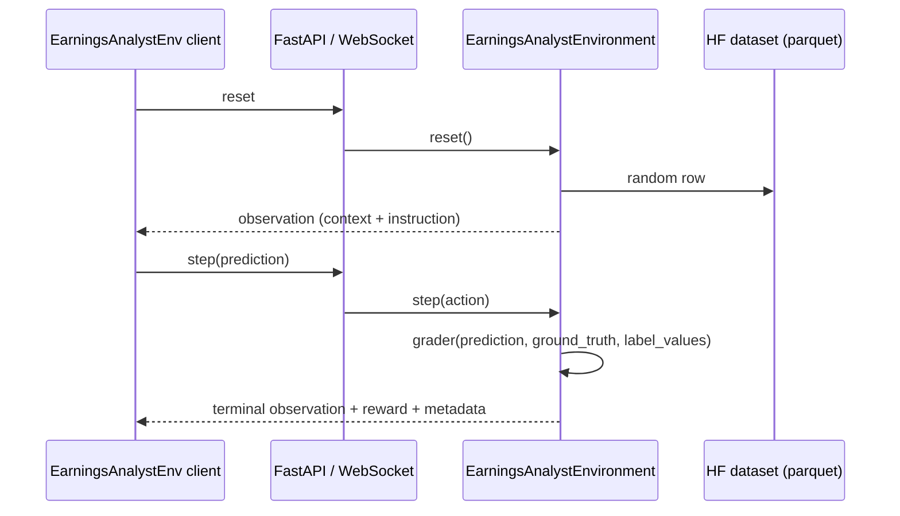

# Earnings Analyst (OpenEnv)

This repository implements an **[OpenEnv](https://github.com/meta-pytorch/OpenEnv)** environment: a FastAPI/WebSocket server that exposes **earnings-call episodes** from a Hugging Face dataset as `reset` / `step` interactions. Each **task** (under `tasks/<name>/`) defines which columns appear in the observation, natural-language instructions for the agent, and how predictions are scored.

Use this document to install dependencies, configure environment variables, run the server and evaluation scripts, and extend the codebase with new tasks.

---

## Overview

| Concept | Description |
|--------|-------------|
| **Episode** | One sampled row from the parquet split. `reset()` draws a row and returns context + instruction; `step(prediction)` scores the agent once and ends the episode (`done=True`). |
| **Task** | A named configuration (`task_id`) with `spec.py` (columns, labels, instruction) and `grader.py` (reward function). Registered in `tasks/registry.py`. |
| **Active task** | Chosen at **server startup** via `EARNINGS_ANALYST_TASK_ID` (or the default in `tasks/registry.py`). The client does not switch tasks per connection—restart the server to change tasks. |
| **Implementation gate** | Until a task’s `spec.py` sets `implemented: True`, `reset()` raises `TaskNotImplementedError` so unfinished tasks are not accidentally evaluated. |

**Dataset:** `DATASET_ID` and `DATASET_FILE` live in `environment_config.py` (default: `RudrakshNanavaty/earnings-call-data`, file `episodes_press_release_8k.parquet`). The loader pins that parquet so ad-hoc files in the same Hub repo are not picked up silently.

---

## Prerequisites

- **Python** ≥ 3.12 (see `pyproject.toml`).
- **[uv](https://docs.astral.sh/uv/)** recommended for installs and locked dependencies (`uv.lock`).
- **Network** on first run: `datasets.load_dataset` downloads the Hub dataset (and may require a [Hugging Face token](https://huggingface.co/docs/huggingface_hub/quick-start#authentication) for gated or private datasets).

---

## Installation

From the repository root:

```bash
uv sync
```

Optional dev tools (pytest, etc.):

```bash
uv sync --extra dev
```

The project installs as the `openenv-earnings_analyst` package with the console script `server` pointing at the FastAPI entrypoint.

---

## Configuration

### Environment variables

Copy `.env.example` to `.env` and fill in values. `.env` is gitignored.

| Variable | Required | Purpose |
|----------|----------|---------|
| `OPENAI_API_KEY` | For `inference.py` / `evaluate.py` | Chat Completions API key (or provider equivalent). |
| `API_BASE_URL` | No | OpenAI-compatible API base (proxies, Azure, Google OpenAI-compat, etc.). |
| `OPENAI_MODEL` | No | Model id (default in scripts often `gpt-4o`; see `.env.example`). |
| `ENV_SERVER_URL` | No | Base URL of the OpenEnv HTTP server (default `http://localhost:8000`). Used by client scripts. |
| `EARNINGS_ANALYST_TASK_ID` | No | Task id the **server** loads at startup. Must match one of `tasks/registry.py` (e.g. `sentiment_label`, `1_day_move`, `30_day_move`, `next_quarter_move`). |

Load order: scripts use `python-dotenv` (`load_dotenv()`), so a local `.env` is picked up when present.

### Dataset and tasks (code)

- **`environment_config.py`** — `DATASET_ID`, `DATASET_FILE`, and re-exports `DEFAULT_TASK` / `TASKS` from `tasks.registry`.
- **`tasks/registry.py`** — Single place to register tasks: append `(SPEC, grade)` to `_TASK_ENTRIES`, and import new task packages.
- **Per-task `spec.py`** — `TaskSpec` fields include `text_cols`, `numerical_cols`, `label_col`, `label_values`, `task_instruction`, `kind`, and `implemented`.

---

## How to run

### 1. Start the environment server

```bash
# Default host 0.0.0.0, port 8000
uv run server

# Custom port (entrypoint forwards to uvicorn)
uv run server --port 8001
```

Equivalent (from repo root, with project on `PYTHONPATH` as `uv` provides):

```bash
uv run uvicorn server.app:app --host 0.0.0.0 --port 8000 --reload
```

Set the active task before starting if you do not want the default:

```bash
export EARNINGS_ANALYST_TASK_ID=sentiment_label
uv run server
```

**Important:** `inference.py` is currently tailored to a **sentiment-style** JSON response and label normalization. For other tasks, adapt the prompt and parsing in `inference.py` (or add task-specific scripts).

### 2. Single-episode inference (OpenAI + env)

Requires a **running server** and `OPENAI_API_KEY`.

```bash
uv run python inference.py
uv run python inference.py --base-url http://localhost:8000 --model gpt-4o-mini --quiet
```

Flow: `reset()` → build user message from observation → Chat Completions → `step(EarningsAnalystAction(prediction=...))` → print reward and metadata.

### 3. Batch evaluation

Runs many episodes via the same `run_episode` helper; aggregates mean reward, exact-match accuracy, and confusion-style counts.

```bash
uv run python evaluate.py
uv run python evaluate.py --samples 50 --task sentiment_label --quiet
```

**Contract:** The server’s `EARNINGS_ANALYST_TASK_ID` must match the task you intend to measure. The `--task` flag selects which **registered spec** is used for **reporting** (e.g. label list for per-label stats)—it does not change the server’s task.

### 4. Docker image

```bash
docker build -t earnings_analyst-env:latest -f server/Dockerfile .
```

The image sets `PYTHONPATH`, runs `uvicorn server.app:app` on port 8000, and includes a health check against `/health`. Pass `EARNINGS_ANALYST_TASK_ID` (and any HF credentials) at runtime as needed.

---

## Architecture (request flow)



- **`server/app.py`** — `create_app(...)` from OpenEnv wires `EarningsAnalystEnvironment` with `EarningsAnalystAction` / `EarningsAnalystObservation`. Exposes HTTP and WebSocket endpoints (`/reset`, `/step`, `/state`, `/schema`, `/ws`, etc.—see OpenEnv docs).
- **`server/earnings_analyst_environment.py`** — Implements `reset` / `step`, resolves `task_id`, builds observations from the active `TaskSpec`, calls `get_grader(task_id)`.
- **`server/dataset_loader.py`** — Module-level `load_dataset(...)` singleton used by every `reset()`.
- **`client.py`** — `EarningsAnalystEnv` (`EnvClient`): WebSocket session, serializes `prediction` on step, parses observations.

---

## Project layout and file reference

### Root

| Path | Role |
|------|------|
| `pyproject.toml` | Package metadata, dependencies, `[project.scripts] server = ...`, setuptools package layout and `package-data` for numeric task folders. |
| `uv.lock` | Locked dependency versions for reproducible `uv sync`. |
| `.env.example` | Documented template for local `.env`. |
| `.gitignore` | Ignores `.venv`, `.env`, build artifacts, etc. |
| `openenv.yaml` | OpenEnv manifest: `app: server.app:app`, port `8000` (e.g. `openenv push` / Spaces-style workflows). |
| `__init__.py` | Public API: `EarningsAnalystEnv`, `EarningsAnalystAction`, `EarningsAnalystObservation`. |
| `environment_config.py` | Hub dataset id/file; re-exports `DEFAULT_TASK`, `TASKS`. |
| `models.py` | Pydantic `EarningsAnalystAction` (`prediction: str`) and `EarningsAnalystObservation` (text/numerical context, instruction, reward, metadata). |
| `client.py` | OpenEnv WebSocket client for this environment. |
| `inference.py` | Example: one episode with OpenAI Chat Completions (sentiment-oriented prompt). |
| `evaluate.py` | Batch metrics over `run_episode` (align server task with `--task` for reporting). |
| `main.py` | Minimal placeholder script (`Hello from earnings-analyst!`). |

### `server/`

| Path | Role |
|------|------|
| `app.py` | FastAPI app factory and `main()` for `uv run server`. |
| `earnings_analyst_environment.py` | Core `Environment` implementation. |
| `dataset_loader.py` | Loads the parquet split once. |
| `Dockerfile` | Multi-stage image using `openenv-base`, `uv sync`, `uvicorn`. |
| `requirements.txt` | Optional pins for Docker/tooling (keep aligned with `pyproject.toml` when changing versions). |
| `__init__.py` | Re-exports `EarningsAnalystEnvironment`. |

### `tasks/` (shared)

| Path | Role |
|------|------|
| `types.py` | `TaskSpec` TypedDict. |
| `exceptions.py` | `TaskNotImplementedError`. |
| `grading.py` | Shared helpers, e.g. `grade_exact`, `grade_ordinal`. |
| `loader.py` | `load_task_subpackage` for folders that are not valid Python module names (`1_day_move`, `30_day_move`). |
| `registry.py` | Registers all tasks; exports `TASKS`, `GRADERS`, `DEFAULT_TASK`, `get_task_spec`, `get_grader`. |

### `tasks/<task_id>/` (per task)

Each task includes **`spec.py`** (`SPEC`, `CANONICAL_TASK_ID`), **`grader.py`** (`grade(predicted, ground_truth, label_values) -> float`), and **`__init__.py`**.

| Folder | `task_id` | Notes |
|--------|-----------|--------|
| `sentiment_label/` | `sentiment_label` | Implemented: ordinal sentiment vs `sentiment_label` column (`grade_ordinal`). |
| `1_day_move/` | `1_day_move` | Loaded via `loader.py` (folder name is not a valid module name). |
| `30_day_move/` | `30_day_move` | Same as above. |
| `next_quarter_move/` | `next_quarter_move` | Regular subpackage under `tasks/`. |

---

## Adding or implementing a task

1. **Define `SPEC`** in `tasks/<folder>/spec.py`: set `text_cols`, `numerical_cols`, `label_col`, `label_values`, `task_instruction`, `kind`, and **`implemented: True`** when ready.
2. **Implement `grade`** in `grader.py` (use `tasks/grading.py` helpers where appropriate).
3. **Register** in `tasks/registry.py`: import the package (or use `load_task_subpackage` for digit-prefixed folder names) and append to `_TASK_ENTRIES`.
4. **Restart the server** with `EARNINGS_ANALYST_TASK_ID=<task_id>`.

If `implemented` is `False`, `reset()` raises `TaskNotImplementedError` with a short message pointing to the task folder.

---

## Troubleshooting

| Symptom | What to check |
|--------|----------------|
| `TaskNotImplementedError` on `reset` | Task’s `spec.py` has `implemented: False` — flip when spec and grader are ready. |
| `Unknown task_id` | Typo in `EARNINGS_ANALYST_TASK_ID` or missing entry in `tasks/registry.py`. |
| Dataset download errors | Network, Hub downtime, or auth (`huggingface-cli login` / `HF_TOKEN`). |
| `inference.py` / OpenAI errors | `OPENAI_API_KEY`, `API_BASE_URL`, and model id; server URL matches `ENV_SERVER_URL`. |
| Reward always 0 or odd metrics | Server task and evaluation script disagree; grader vs label format; `inference.py` still sentiment-specific for non-sentiment tasks. |

---

## Hugging Face Spaces / OpenEnv CLI

The repo includes Spaces-oriented YAML in this file’s frontmatter and `openenv.yaml`. For `openenv push` or Space deployment, follow the current OpenEnv CLI documentation; the HTTP app entry is `server.app:app` on port **8000**.

---

## License and dependencies

See `pyproject.toml` for dependency versions. Core runtime includes `openenv-core`, `datasets`, `pydantic` (via OpenEnv), `openai` (for the example scripts), and `python-dotenv`.
