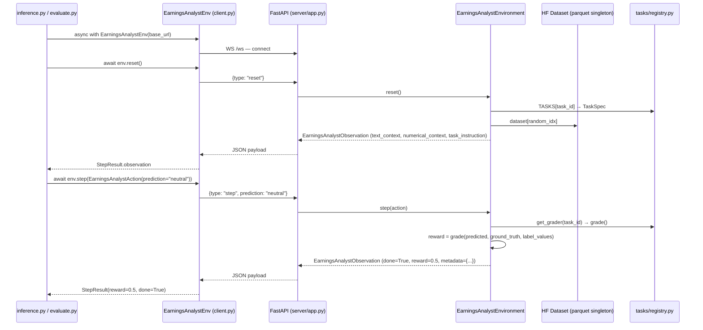

# Earnings Lens — Code Wiki

> Package: `openenv-earnings_analyst` v0.1.0  
> Repo: `RudrakshNanavaty/earnings-lens`  
> Python ≥ 3.12 · Dependency manager: `uv`

---

## Table of Contents

1. [Project Overview](#1-project-overview)
2. [Repository Layout](#2-repository-layout)
3. [Architecture & Data Flow](#3-architecture--data-flow)
4. [Module Reference](#4-module-reference)
   - [Root Package (`earnings_analyst`)](#41-root-package-earnings_analyst)
   - [`models.py`](#42-modelspy)
   - [`client.py`](#43-clientpy)
   - [`environment_config.py`](#44-environment_configpy)
   - [`server/`](#45-server)
   - [`tasks/`](#46-tasks)
5. [Task System Deep-Dive](#5-task-system-deep-dive)
   - [`TaskSpec` schema](#51-taskspec-schema)
   - [Task registry](#52-task-registry)
   - [Grading helpers](#53-grading-helpers)
   - [Task inventory](#54-task-inventory)
6. [Environment Lifecycle](#6-environment-lifecycle)
7. [Inference & Evaluation Scripts](#7-inference--evaluation-scripts)
8. [Configuration Reference](#8-configuration-reference)
9. [Deployment](#9-deployment)
10. [Adding a New Task](#10-adding-a-new-task)
11. [Key Design Decisions & Gotchas](#11-key-design-decisions--gotchas)

---

## 1. Project Overview

**Earnings Lens** is an [OpenEnv](https://github.com/meta-pytorch/OpenEnv) environment that wraps a Hugging Face earnings-call dataset as an RL interaction loop. An LLM agent receives one row of earnings-call data (transcripts, press releases, market numerics) and must predict a task-specific target (e.g. sentiment label, or a price move). The server scores the prediction and returns a reward.

**Core concepts:**

| Term | Meaning |
|------|---------|
| **Episode** | One dataset row. `reset()` samples it; `step(prediction)` scores it. Always terminal after one step (`done=True`). |
| **Task** | Named configuration (`task_id`) with a `TaskSpec` (what columns to expose, what to predict) and a `grade()` function. |
| **Active task** | Chosen at server startup via `EARNINGS_ANALYST_TASK_ID`. Cannot be changed per-connection. |
| **Implementation gate** | `spec["implemented"] = False` blocks `reset()` with `TaskNotImplementedError`, preventing accidental evaluation of stub tasks. |

---

## 2. Repository Layout

```
earnings-lens/
├── __init__.py                    # Public API: EarningsAnalystEnv, Action, Observation
├── models.py                      # Pydantic Action + Observation models
├── client.py                      # WebSocket EnvClient subclass
├── environment_config.py          # Dataset ID/file; re-exports DEFAULT_TASK, TASKS
├── inference.py                   # Example: single-episode OpenAI inference
├── evaluate.py                    # Batch evaluation over N episodes
├── main.py                        # Placeholder ("Hello from earnings-analyst!")
├── openenv.yaml                   # OpenEnv Spaces manifest (app: server.app:app, port 8000)
├── pyproject.toml                 # Package metadata, deps, console script `server`
├── uv.lock                        # Locked deps for `uv sync`
├── .env.example                   # Template for local .env
│
├── server/
│   ├── __init__.py                # Re-exports EarningsAnalystEnvironment
│   ├── app.py                     # FastAPI app factory + main() entrypoint
│   ├── earnings_analyst_environment.py  # Core Environment: reset / step
│   ├── dataset_loader.py          # Module-level HF dataset singleton
│   ├── Dockerfile                 # Production Docker image
│   └── requirements.txt           # Optional pins for Docker / tooling
│
└── tasks/
    ├── __init__.py                # Re-exports registry symbols + TaskNotImplementedError
    ├── types.py                   # TaskSpec TypedDict
    ├── exceptions.py              # TaskNotImplementedError
    ├── grading.py                 # Shared helpers: grade_ordinal, grade_exact
    ├── loader.py                  # load_task_subpackage() for digit-prefixed folders
    ├── registry.py                # Central task registry: TASKS, GRADERS, get_grader()
    │
    ├── sentiment_label/           # ✅ Implemented
    │   ├── spec.py
    │   ├── grader.py
    │   └── __init__.py
    ├── 1_day_move/                # 🚧 Stub
    │   ├── spec.py
    │   ├── grader.py
    │   └── __init__.py
    ├── 30_day_move/               # 🚧 Stub
    │   ├── spec.py
    │   ├── grader.py
    │   └── __init__.py
    └── next_quarter_move/         # 🚧 Stub
        ├── spec.py
        ├── grader.py
        └── __init__.py
```

---

## 3. Architecture & Data Flow



**Key transport details:**
- The client uses a **persistent WebSocket** (`WS /ws`), not HTTP POST per call, for lower latency.
- The server also exposes `POST /reset`, `POST /step`, `GET /state`, and `GET /schema` for HTTP-only clients.
- `max_concurrent_envs=1` in `app.py` — increase for parallel evaluation runs.

---

## 4. Module Reference

### 4.1 Root Package (`earnings_analyst`)

**`__init__.py`** — Public surface of the installable package:

```python
from .client import EarningsAnalystEnv
from .models import EarningsAnalystAction, EarningsAnalystObservation

__all__ = ["EarningsAnalystAction", "EarningsAnalystObservation", "EarningsAnalystEnv"]
```

External consumers import these three names; everything else is internal.

---

### 4.2 `models.py`

Defines the two Pydantic models that flow between client and server.

#### `EarningsAnalystAction(Action)`

| Field | Type | Description |
|-------|------|-------------|
| `prediction` | `str` | Agent's answer — format depends on task (e.g. `"bullish"`, `"0.032"`). |

#### `EarningsAnalystObservation(Observation)`

| Field | Type | Description |
|-------|------|-------------|
| `text_context` | `dict[str, str]` | Keyed by column name. Only columns listed in `spec["text_cols"]` with non-empty values appear here. |
| `numerical_context` | `dict[str, float]` | Keyed by column name. Only finite (non-NaN) values from `spec["numerical_cols"]` appear. |
| `task_instruction` | `str` | Natural-language prompt copied from `spec["task_instruction"]`. Tells the agent exactly what to return. |
| `done` | `bool` | `False` after `reset()`, `True` after `step()`. |
| `reward` | `float \| None` | `0.0` after `reset()`, task-specific score after `step()`. |
| `metadata` | `dict` | After `step()`: `{task_id, predicted, ground_truth}`. Empty after `reset()`. |

---

### 4.3 `client.py`

**`EarningsAnalystEnv(EnvClient[Action, Observation, State])`**

A typed wrapper around `openenv-core`'s `EnvClient`. Used as an async context manager.

| Method | Purpose |
|--------|---------|
| `_step_payload(action)` | Serializes action to `{"prediction": str}` for the WebSocket message. |
| `_parse_result(payload)` | Deserializes JSON response into `StepResult[EarningsAnalystObservation]`. |
| `_parse_state(payload)` | Deserializes `{"episode_id", "step_count"}` into `State`. |

> [!NOTE]
> `EarningsAnalystEnv` also supports `from_docker_image(image_tag)` — a class method from the base class that spins up a Docker container and connects automatically.

**Typical usage:**
```python
async with EarningsAnalystEnv(base_url="http://localhost:8000") as env:
    reset_result = await env.reset()
    obs = reset_result.observation          # EarningsAnalystObservation
    step_result = await env.step(EarningsAnalystAction(prediction="bullish"))
    print(step_result.reward)
```

---

### 4.4 `environment_config.py`

Thin config module. Provides two constants and re-exports task registry symbols.

| Symbol | Value |
|--------|-------|
| `DATASET_ID` | `"RudrakshNanavaty/earnings-call-data"` |
| `DATASET_FILE` | `"episodes_press_release_8k.parquet"` |
| `DEFAULT_TASK` | `"sentiment_label"` (re-exported from registry) |
| `TASKS` | `dict[str, TaskSpec]` (re-exported) |

---

### 4.5 `server/`

#### `server/dataset_loader.py`

Executes **once on first import** (module-level singleton):

```python
dataset = load_dataset(
    DATASET_ID,
    data_files={"train": DATASET_FILE},
    split="train",
)
```

- Pins the specific parquet file to avoid silently picking up other files in the same Hub repo.
- All `reset()` calls reference this single in-memory object; no repeated downloads.
- On first run, `datasets` will download and cache to `~/.cache/huggingface/`.

#### `server/app.py`

Creates the FastAPI application via OpenEnv's factory:

```python
app = create_app(
    EarningsAnalystEnvironment,
    EarningsAnalystAction,
    EarningsAnalystObservation,
    env_name="earnings_analyst",
    max_concurrent_envs=1,
)
```

**`main(host, port)`** — entrypoint used by `uv run server` (defined in `pyproject.toml` as `server = "earnings_analyst.server.app:main"`). Accepts `--port` via argparse.

Exposed HTTP/WS endpoints (from OpenEnv):

| Endpoint | Method | Purpose |
|----------|--------|---------|
| `/reset` | POST | Reset and return initial observation |
| `/step` | POST | Execute action, receive reward |
| `/state` | GET | Current `episode_id` + `step_count` |
| `/schema` | GET | JSON schemas for Action and Observation |
| `/ws` | WebSocket | Persistent session (preferred by client) |
| `/health` | GET | Docker health check target |
| `/web` | GET | OpenEnv web UI (base_path in HF Spaces) |

#### `server/earnings_analyst_environment.py`

**`EarningsAnalystEnvironment(Environment)`** — the core RL logic.

```
__init__(task_id=None)
    ↳ _resolve_task_id()        # env var → DEFAULT_TASK fallback
    ↳ TASKS[task_id]            # KeyError if unknown
    ↳ State(episode_id=uuid4)

reset() → EarningsAnalystObservation
    ↳ Check cfg["implemented"] or raise TaskNotImplementedError
    ↳ random row from dataset
    ↳ Filter text_cols (non-empty strings only)
    ↳ Filter numerical_cols (finite floats only, drops NaN)
    ↳ Return observation (done=False, reward=0.0)

step(action) → EarningsAnalystObservation
    ↳ get_grader(task_id)(prediction, ground_truth, label_values)
    ↳ Return terminal observation (done=True, reward=float, metadata)

state → State (property)
```

**Helper functions in the same file:**

| Function | Purpose |
|----------|---------|
| `_resolve_task_id(explicit)` | `explicit` → `EARNINGS_ANALYST_TASK_ID` env var → `DEFAULT_TASK` |
| `_non_empty_text(value)` | Returns `True` if value is a non-blank string |
| `_finite_float(value)` | Converts to float; returns `None` for NaN or unconvertible values |

> [!IMPORTANT]
> `SUPPORTS_CONCURRENT_SESSIONS = True` is set on the class, meaning the server can manage multiple independent environments if `max_concurrent_envs` in `app.py` is increased.

---

### 4.6 `tasks/`

The task system is the main extension point. Full breakdown in [§5](#5-task-system-deep-dive).

| Module | Exports |
|--------|---------|
| `tasks/types.py` | `TaskSpec` (TypedDict) |
| `tasks/exceptions.py` | `TaskNotImplementedError` |
| `tasks/grading.py` | `grade_ordinal()`, `grade_exact()` |
| `tasks/loader.py` | `load_task_subpackage()` |
| `tasks/registry.py` | `TASKS`, `GRADERS`, `TASK_IDS`, `DEFAULT_TASK`, `get_task_spec()`, `get_grader()` |
| `tasks/__init__.py` | Re-exports all of the above |

---

## 5. Task System Deep-Dive

### 5.1 `TaskSpec` schema

Defined in `tasks/types.py` as a `TypedDict`:

| Field | Type | Required | Description |
|-------|------|----------|-------------|
| `task_id` | `str` | ✅ | Unique identifier (e.g. `"sentiment_label"`). Must match the key in `TASKS`. |
| `implemented` | `bool` | ✅ | Gate flag. `False` → `reset()` raises `TaskNotImplementedError`. |
| `text_cols` | `list[str]` | ✅ | Dataset column names to include as `text_context`. |
| `numerical_cols` | `list[str]` | ✅ | Dataset column names to include as `numerical_context`. |
| `label_col` | `str` | ✅ | Column used as ground truth during `step()`. |
| `label_values` | `list[str]` | ✅ | Ordered list of valid labels (used by ordinal graders; empty for regression stubs). |
| `task_instruction` | `str` | ✅ | Full natural-language prompt shown to the agent as `observation.task_instruction`. |
| `kind` | `Literal["classification", "regression", "other"]` | ✅ | Metadata for reporting; not enforced by the environment. |

### 5.2 Task registry

**`tasks/registry.py`** is the single source of truth for all tasks.

```python
_TASK_ENTRIES: list[tuple[TaskSpec, GradingFn]] = [
    (sentiment_label.SPEC, sentiment_label.grade),
    (_pkg_1_day_move.SPEC, _pkg_1_day_move.grade),
    (_pkg_30_day_move.SPEC, _pkg_30_day_move.grade),
    (next_quarter_move.SPEC, next_quarter_move.grade),
]

TASKS:   dict[str, TaskSpec]    # keyed by task_id
GRADERS: dict[str, GradingFn]   # keyed by task_id
DEFAULT_TASK = "sentiment_label"
```

`GradingFn` type alias: `Callable[[str, str, list[str]], float]` — `(predicted, ground_truth, label_values) → reward`.

**Why `load_task_subpackage()`?**  
Python module names cannot start with a digit. Folders `1_day_move` and `30_day_move` are not importable via `import tasks.1_day_move`. `loader.py` uses `importlib.util.spec_from_file_location` to load them under synthetic qualified names (`earnings_analyst.tasks._pkg_1_day_move`, etc.) and injects them into `sys.modules`.

### 5.3 Grading helpers

**`tasks/grading.py`**:

#### `grade_ordinal(predicted, ground_truth, label_values) → float`

Ordinal (rank-aware) similarity reward for ordered label lists.

| Condition | Reward |
|-----------|--------|
| Exact match | `1.0` |
| Adjacent label (distance = 1) | `0.5` |
| Distance ≥ 2 or label not found | `0.0` |

Example for `label_values = ["very bearish", "bearish", "neutral", "bullish", "very bullish"]`:
- predicted=`"bullish"`, truth=`"bullish"` → `1.0`
- predicted=`"neutral"`, truth=`"bullish"` → `0.5`
- predicted=`"very bearish"`, truth=`"very bullish"` → `0.0`

#### `grade_exact(predicted, ground_truth, label_values) → float`

Binary reward: `1.0` if case-insensitive stripped match, else `0.0`. `label_values` is ignored.

### 5.4 Task inventory

| `task_id` | `kind` | Status | Grader | Text columns | Numerical columns |
|-----------|--------|--------|--------|--------------|-------------------|
| `sentiment_label` | classification | ✅ Implemented | `grade_ordinal` | `earnings_transcript`, `press_release_8k_body`, `press_release_ex991`, `press_release_ex992` | `price_momentum_30d`, `price_momentum_90d`, `pct_from_52w_high_pt`, `avg_volume_20d`, `d_minus_1_close` |
| `1_day_move` | regression | 🚧 Stub | raises `NotImplementedError` | (none) | (none) |
| `30_day_move` | regression | 🚧 Stub | raises `NotImplementedError` | (none) | (none) |
| `next_quarter_move` | regression | 🚧 Stub | raises `NotImplementedError` | (none) | (none) |

**`sentiment_label` label order** (ordinal, worst → best):
```
very bearish → bearish → neutral → bullish → very bullish
```

---

## 6. Environment Lifecycle

```
Server startup
    │
    ├── dataset_loader.py imported → HF parquet fetched/cached → dataset singleton
    └── EarningsAnalystEnvironment.__init__()
            ├── _resolve_task_id()     (env var / default)
            ├── TASKS[task_id]         (KeyError if unknown)
            └── State(episode_id=uuid4, step_count=0)
                    │
                    ▼  client calls reset()
            reset()
            ├── Check cfg["implemented"] → TaskNotImplementedError if False
            ├── State reset (new uuid4, step_count=0)
            ├── dataset[random.randrange(len(dataset))]
            ├── Build text_context  (non-empty strings from text_cols)
            ├── Build numerical_context (finite floats from numerical_cols)
            └── Return EarningsAnalystObservation(done=False, reward=0.0)
                    │
                    ▼  client calls step(action)
            step(action)
            ├── state.step_count += 1
            ├── ground_truth = row[label_col]
            ├── grade_fn = get_grader(task_id)
            ├── reward = float(grade_fn(prediction, ground_truth, label_values))
            └── Return EarningsAnalystObservation(done=True, reward=reward,
                        metadata={task_id, predicted, ground_truth})
```

> [!NOTE]
> Each episode is **always terminal after exactly one step**. There is no multi-step trajectory — the environment is episodic/bandit-style.

---

## 7. Inference & Evaluation Scripts

### `inference.py`

Single-episode example implementation using OpenAI Chat Completions. Currently **hardcoded for sentiment classification** — requires adaptation for other tasks.

**Key functions:**

| Function | Signature | Purpose |
|----------|-----------|---------|
| `build_user_content(obs)` | `EarningsAnalystObservation → str` | Assembles the user message from `task_instruction` + formatted `text_context` + JSON `numerical_context`. |
| `predict_with_openai(obs, *, client, model, valid_labels)` | `→ tuple[str, str]` | Calls Chat Completions with `response_format=json_object`, parses `{"sentiment": ...}`, normalizes with `_normalize_sentiment()`. |
| `_normalize_sentiment(text, valid)` | `→ str` | Case-insensitive fuzzy match to canonical labels; fallback `"neutral"`. |
| `run_episode(*, base_url, openai_api_key, ...)` | `async → EpisodeResult` | Full `reset → predict → step` flow. Returns `EpisodeResult(reward, predicted, ground_truth, done, model_response_text)`. |
| `main()` | CLI entrypoint | Parses `--base-url`, `--model`, `--quiet`. |

**CLI:**
```bash
uv run python inference.py
uv run python inference.py --base-url http://localhost:8000 --model gpt-4o-mini --quiet
```

---

### `evaluate.py`

Runs `N` independent episodes (each a full `run_episode()` call) and aggregates metrics.

**Key functions:**

| Function | Purpose |
|----------|---------|
| `exact_match(predicted, ground_truth)` | Case-insensitive strip comparison → bool |
| `confusion_key(predicted, ground_truth)` | Returns normalized `(predicted, truth)` tuple for confusion matrix |
| `run_evaluation(*, samples, base_url, model, task_id, quiet)` | Main async loop; prints summary table |

**Output:**
```
=== Evaluation summary ===
samples: 100
mean_reward: 0.6250
exact_accuracy: 0.5000 (50/100)

Per ground-truth label (exact match rate):
  'very bearish': 0.4000 (2/5)
  'bearish': 0.3333 (4/12)
  ...

Confusion (predicted -> counts by ground_truth):
  truth='bullish': 'bullish':30, 'neutral':5
  ...
```

**CLI:**
```bash
uv run python evaluate.py
uv run python evaluate.py --samples 50 --task sentiment_label --quiet
```

> [!WARNING]
> The `--task` flag only controls which `TaskSpec` is used for **reporting** (label list). It does **not** change the server's active task. The server's `EARNINGS_ANALYST_TASK_ID` must be set before startup.

---

## 8. Configuration Reference

### Environment variables

| Variable | Required | Default | Description |
|----------|----------|---------|-------------|
| `OPENAI_API_KEY` | For inference/evaluate | — | Chat Completions key |
| `OPENAI_BASE_URL` | No | OpenAI default | Custom API base (proxies, Azure, Google OpenAI-compat) |
| `OPENAI_MODEL` | No | `gpt-4o` | Model ID for inference scripts |
| `ENV_SERVER_URL` | No | `http://localhost:8000` | Base URL for `EarningsAnalystEnv` in client scripts |
| `EARNINGS_ANALYST_TASK_ID` | No | `sentiment_label` | Task loaded at **server startup** |
| `HF_TOKEN` | For private datasets | — | Hugging Face auth token |

Load order: `python-dotenv` reads `.env` first (copy from `.env.example`).

### Dataset configuration (`environment_config.py`)

| Constant | Value |
|----------|-------|
| `DATASET_ID` | `RudrakshNanavaty/earnings-call-data` |
| `DATASET_FILE` | `episodes_press_release_8k.parquet` |

To switch datasets: edit these two constants and restart the server.

---

## 9. Deployment

### Local development

```bash
uv sync                        # install deps
uv run server                  # starts on 0.0.0.0:8000
uv run server --port 8001      # custom port

# Or with uvicorn directly (auto-reload):
uv run uvicorn server.app:app --host 0.0.0.0 --port 8000 --reload
```

Set task before starting:
```bash
export EARNINGS_ANALYST_TASK_ID=sentiment_label
uv run server
```

### Docker (`server/Dockerfile`)

```bash
# Build
docker build -t earnings_analyst-env:latest -f server/Dockerfile .

# Run
docker run -p 8000:8000 \
  -e EARNINGS_ANALYST_TASK_ID=sentiment_label \
  -e HF_TOKEN=hf_... \
  earnings_analyst-env:latest
```

The Dockerfile:
- Uses `openenv-base` as the base image
- Runs `uv sync` to install deps
- Entry: `uvicorn server.app:app` on port 8000
- Health check: `GET /health`

### Hugging Face Spaces

The repo frontmatter and `openenv.yaml` configure HF Spaces deployment:
- `sdk: docker` → uses `server/Dockerfile`
- `app_port: 8000`, `base_path: /web`
- App entry: `server.app:app`

Pass `EARNINGS_ANALYST_TASK_ID` and `HF_TOKEN` as Space secrets.

---

## 10. Adding a New Task

### Step-by-step

**1. Create the task directory**

```
tasks/
└── my_task/
    ├── __init__.py
    ├── spec.py
    └── grader.py
```

> [!TIP]
> If the folder name starts with a digit (e.g. `5_day_move`), follow the `1_day_move` pattern and use `load_task_subpackage` in `registry.py`.

**2. Define `spec.py`**

```python
from ..types import TaskSpec

CANONICAL_TASK_ID = "my_task"

SPEC: TaskSpec = {
    "task_id": CANONICAL_TASK_ID,
    "implemented": True,                       # Set False until ready
    "text_cols": ["earnings_transcript"],      # Columns from the parquet
    "numerical_cols": ["price_momentum_30d"],
    "label_col": "my_target_column",           # Ground truth column
    "label_values": ["low", "medium", "high"], # Ordered if ordinal
    "task_instruction": (
        "Predict the price category.\n\n"
        'Return JSON: {"category": "<low|medium|high>"}'
    ),
    "kind": "classification",                  # or "regression" / "other"
}
```

**3. Implement `grader.py`**

```python
from ..grading import grade_ordinal  # or grade_exact, or custom logic

def grade(predicted: str, ground_truth: str, label_values: list[str]) -> float:
    return grade_ordinal(predicted, ground_truth, label_values)
```

**4. Export from `__init__.py`**

```python
from .spec import SPEC
from .grader import grade

__all__ = ["SPEC", "grade"]
```

**5. Register in `tasks/registry.py`**

For a regular folder name:
```python
from . import my_task   # add this import

_TASK_ENTRIES: list[...] = [
    ...
    (my_task.SPEC, my_task.grade),  # add this line
]
```

For a digit-prefixed folder name:
```python
_pkg_5_day_move = load_task_subpackage(
    "5_day_move",
    "earnings_analyst.tasks._pkg_5_day_move",
)
# then add to _TASK_ENTRIES:
(_pkg_5_day_move.SPEC, _pkg_5_day_move.grade),
```

**6. (If needed) Update `pyproject.toml`**

Regular folders are already covered by `package-dir`. For digit-prefixed folders, they're loaded as data files — confirm `package-data` includes `"my_task/*.py"`:
```toml
[tool.setuptools.package-data]
"earnings_analyst.tasks" = ["1_day_move/*.py", "30_day_move/*.py", "5_day_move/*.py"]
```

**7. Restart the server**

```bash
export EARNINGS_ANALYST_TASK_ID=my_task
uv run server
```

---

## 11. Key Design Decisions & Gotchas

### Dual-import fallback pattern

Every module uses a try/except import pattern:
```python
try:
    from earnings_analyst.tasks.registry import ...  # installed package
except ImportError:
    from tasks.registry import ...                   # repo root on PYTHONPATH
```
This makes scripts runnable both as `uv run python inference.py` (PYTHONPATH=root) and from the installed package.

### Dataset is a global singleton

`dataset_loader.py` loads the HF dataset **once** at import time. Benefits: fast resets, no redundant downloads. Caveat: the server process must have sufficient memory to hold the dataset. There is no streaming or lazy loading.

### Single-step episodes (bandit)

Every episode is exactly `reset() → step()`. `done=True` is always returned from `step()`. This means standard RL algorithms that expect trajectories need adaptation (treat as contextual bandit).

### `max_concurrent_envs=1`

The server currently supports only one concurrent WebSocket session. For parallel evaluation, either:
- Run multiple server processes on different ports, or
- Increase `max_concurrent_envs` in `server/app.py`.

### `inference.py` is sentiment-specific

The `predict_with_openai()` function is hardcoded to return `{"sentiment": ...}`. For other tasks, you must write a new prediction function (different system prompt, different JSON key, different normalization).

### Task server vs. evaluation script alignment

`evaluate.py --task <id>` only selects which `TaskSpec` to use for **printing per-label stats**. The actual grading happens on the **server** using `EARNINGS_ANALYST_TASK_ID`. If these disagree, label statistics will be meaningless (wrong label list).

### `implemented` gate is enforced only in `reset()`

Setting `implemented: False` prevents `reset()` but does **not** prevent the task from appearing in `TASKS` or `GRADERS`. The grader's `NotImplementedError` is only hit if someone calls `step()` on a row from a stub task — which can't happen via normal flow since `reset()` blocks first.
